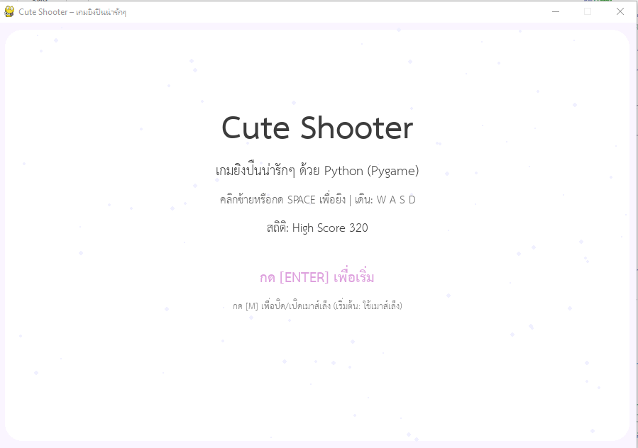
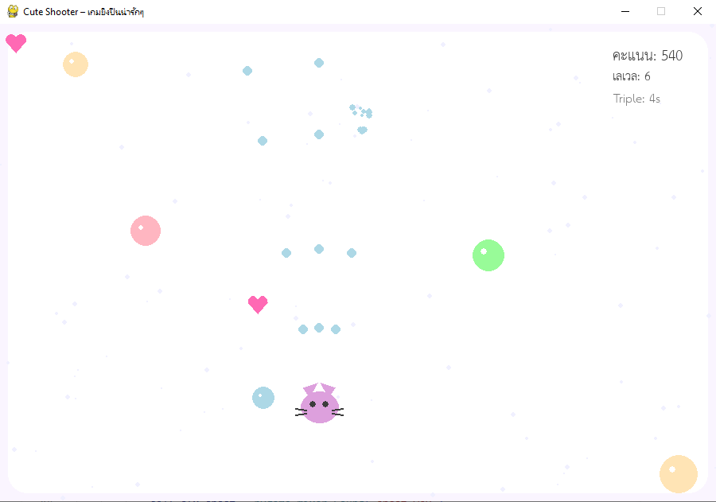

# 🐱 Cute Shooter – เกมยิงปืนน่ารักๆ ด้วย Python (Pygame)

> เกมยิงปืนน่ารัก ๆ ทำด้วย **Python + Pygame**  
> เล่นง่าย สนุก มีเสียงประกอบ เพลงพื้นหลัง และเอฟเฟคพาร์ติเคิลน่ารัก ๆ 💖  




## ✨ ฟีเจอร์เด่น
- กราฟิกโทนสี **Pastel** สบายตา 🎨
- ตัวละครแมวน่ารัก 🐱
- ศัตรูเจลลี่หลากหลายสี
- ไอเทมบัพ:
  - ❤️ เพิ่มพลังชีวิต (Heart)
  - 🔫 ยิงสามทาง (Triple Shot)
- เพลงพื้นหลัง + เสียงเอฟเฟคครบ:
  - เสียงยิง
  - เสียงโดน
  - เสียงเก็บไอเทม
- ระบบ **คะแนน (Score)**, **เลเวล (Level)** และ **High Score**
- รองรับการบันทึกสถิติ (บันทึกเป็นไฟล์ `cute_shooter_save.json`)

---

## 🎮 วิธีเล่น
| คำสั่ง | การใช้งาน |
|---------|------------|
| `W / A / S / D` | เดินขึ้น / ซ้าย / ลง / ขวา |
| `SPACE` | ยิงกระสุนตรงขึ้น |
| **คลิกซ้ายเมาส์** | ยิงตามตำแหน่งเมาส์ |
| `M` | สลับโหมดเล็ง (เมาส์ / ปุ่ม Space) |
| `P` | หยุดเกม (Pause) |
| `ESC` | กลับเมนูหรือออกจากเกม |
| `ENTER` | เริ่มเกม / เล่นอีกครั้ง |

---

## 📦 วิธีติดตั้ง

> **ขั้นตอนแรก:** ติดตั้ง Python 3.9+ และ Pygame

```bash
# ติดตั้ง pygame
pip install pygame

ดาวน์โหลดโปรเจกต์:
git clone https://github.com/tana-pixel/cute_shooter-game.git
cd cute-shooter

รันเกม:
python cute_shooter.py

📝 License

โปรเจกต์นี้แจกภายใต้สัญญา MIT License
สามารถนำไปปรับแต่งและพัฒนาได้อิสระ

❤️ ผู้พัฒนา

tana pittayatanadol
tana.pittayatanadol@gmail.com

ขอบคุณที่เล่นเกมนี้! หากชอบโปรเจกต์นี้ อย่าลืม ⭐ Star ที่ GitHub Repository ด้วยนะครับ
=======
ขอบคุณที่เล่นเกมนี้! หากชอบโปรเจกต์นี้ อย่าลืม ⭐ Star ที่ GitHub Repository ด้วยนะครับ
